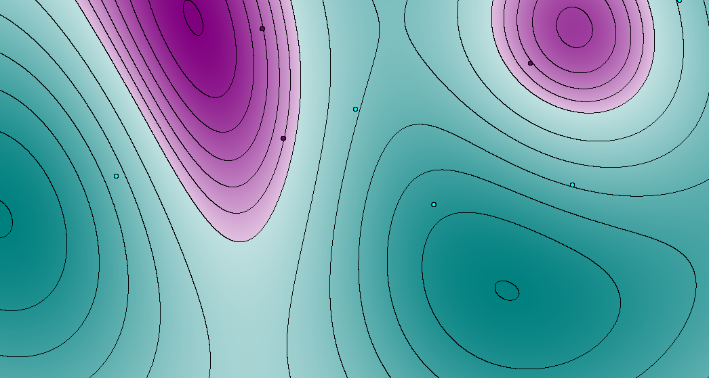

# perceptron

Classifies examples provided by the user (L and R mouse buttons). Uses the perceptron algorithm for producing the classifier. Can create non-linear classification surfaces by using a gaussian kernel. The form of the perceptron that uses a kernel is called the dual perceptron.

